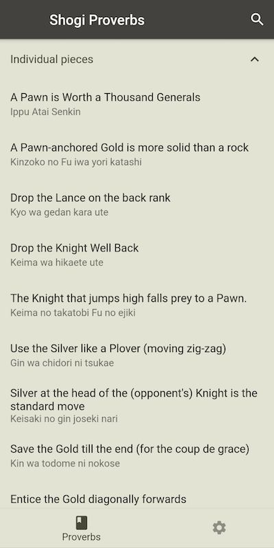

# Shogi Proverbs

Shogi (将棋) is a two-player strategy board game native to Japan, belonging to the same family as chess and xiangqi. Shogi proverbs are technical tips for the player to lead them in the right direction when they are unsure of what move to play. This app contains 50 such proverbs for beginner to intermediate players. 

## Content

These proverbs are taken from Takako Tombo Noda's [website](http://www.shogi.net/kakugen/), which in turn contains translations of Masahiko Urano's book *Shogi Kakugen Mame Jiten (Tiny dictionary of Shogi proverbs)*. Although this website is still online, it is not optimized for mobile, while the diagrams can be difficult to decipher. 

The goal of this open source project is to make this excellent content more accessible to beginners in the mobile age. As Mr. Urano gave permission to Mr. Noda to publish his content online to help beginner players around the world, it is assumed that neither Mr. Noda nor Mr. Urano would similarly not support this project's goal. No copyright infringement is intended.

## Features

<table>
<tr>
    <td></td>
    <td></td>
    <td></td>
</tr>
</table>

- 50 proverbs covering individual pieces, openings, middle-game and end-game.
- Light/Dark Mode support.
- Ability to view pieces as 玉/K.
- Visually distinguish which proverbs have been previously read.

## Download

Shogi Proverbs is presently available to download as a test version via TestFlight on iOS or Google Play on Android. Please visit the following links for more information:

<table>
<tr>
    <td><a href="https://testflight.apple.com/join/s3lfPRLU">iOS</a></td>
    <td><a href="https://play.google.com/store/apps/details?id=com.defuncart.shogiproverbs">Android</a></td>
</tr>
</table>

The app is presently optimized for mobile. A web simulation can be found at [http://defuncart.com/shogi_proverbs](http://defuncart.com/shogi_proverbs).

## Getting Started

If you would like to build the app yourself, then you simply need:

- Flutter >= 3.16
- Dart >= 3.2
- Xcode >= 13.4
- Android SDK >= 33

To generate app icons, simply run `flutter pub run flutter_launcher_icons`.

## Contributing

If you noticed any notation issues, please open an [issue](https://github.com/defuncart/shogi_proverbs/issues) or create a pull request.

## Credits

- Concept, Design and Programming by James Leahy.
- All proverbs taken from *Shogi Kakugen Mame Jiten (Tiny dictionary of Shogi proverbs)* by Masahiko Urano, in the form presented on Takako Tombo Noda's [website](http://www.shogi.net/kakugen/).

Special thanks to [takodori](https://www.reddit.com/user/takodori/) whose Shogi Playground [diagrams](https://www.reddit.com/r/shogi/comments/822oda/diagram_updates_shogi_proverbs_with_commentaries/) greatly aided in the quick integration of board diagrams.
